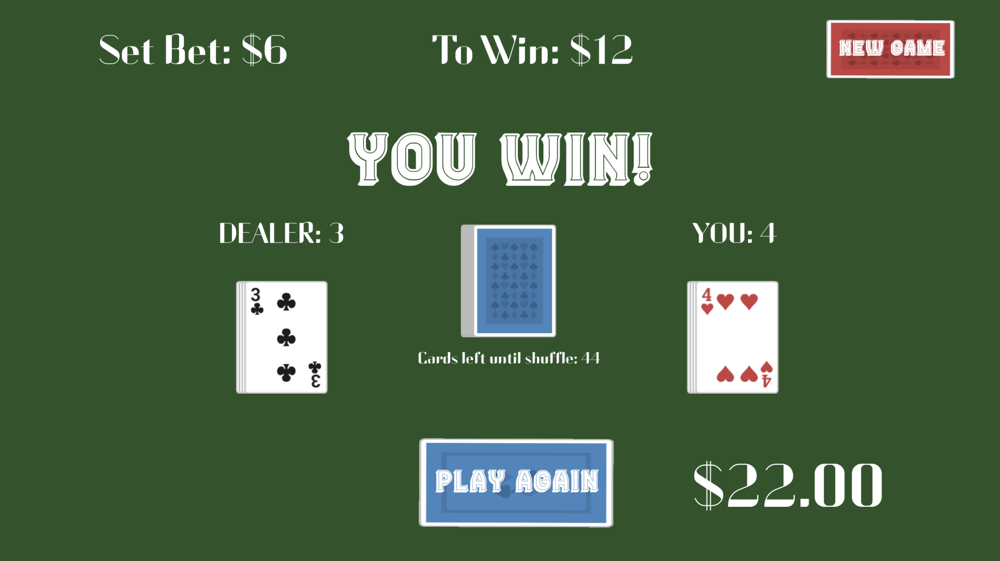
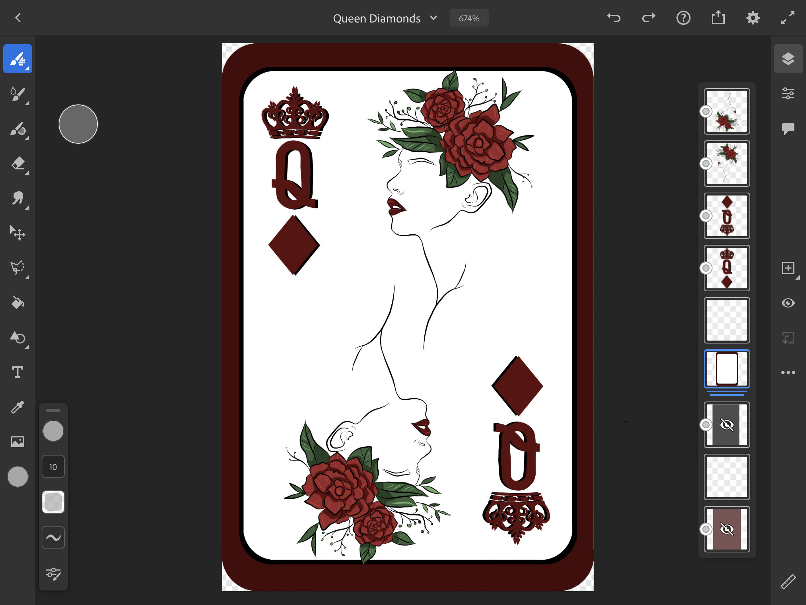
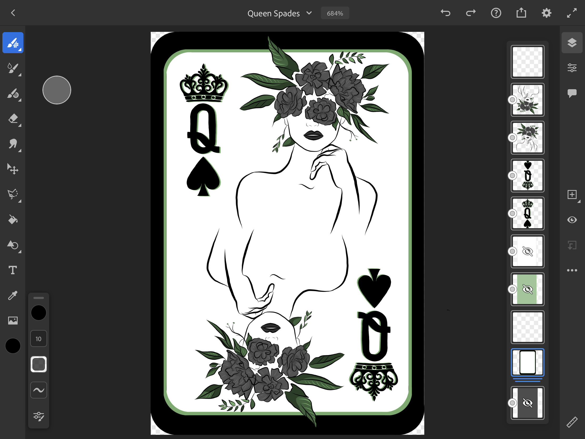
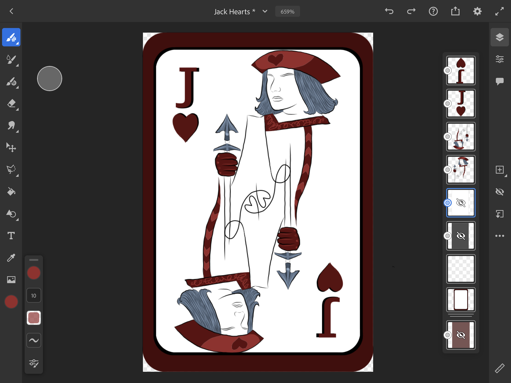
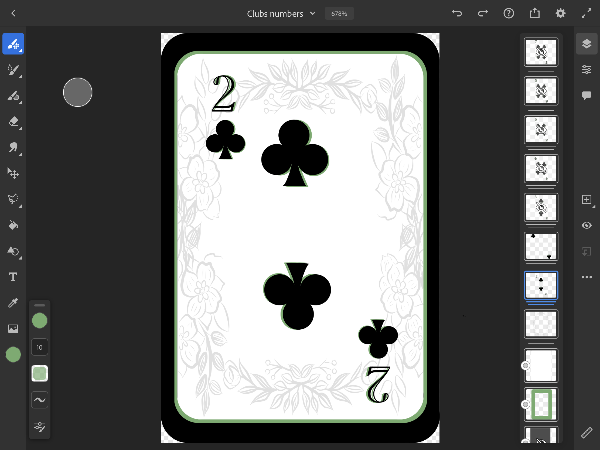

# High Low Card Game

---

## Description

  *The what, why, and how:*

`PROJECT DESCRIPTION:` This project is a high-low poker card game where the higher card takes the win! This game was created in Unity using C#. This is both my first attempt at creating a game and writing in this language.

  ---

  ## Table of Contents

  - [Description](#description)
  - [Logic](#logic)
    - [Creating The Deck](#creating-the-deck)
    - [Shuffling](#shuffling)
    - [Betting](#Betting)
  - [Designs](#designs)
  - [Usage](#usage)
  - [Technologies](#technologies)
  - [Questions](#questions)
 
 ---
  
  
  ## Logic
  *How I went about creating this project*
    
### `Creating The Deck:`

 ---
To start off this project, I had to think about how a I wanted to represent my deck of cards in a way that they were able to be assigned a value. This is necessary because without the values, we aren't able to compare the cards to see who wins! I had 3 different ideas for my deck; 
1. Program each card individually, 
2. Creating two arrays [one with Card suites/one with numbers] then use concat to create one array with each number/suite assigned
3. Create a list called 'cards' and assign them each a sprite. Then, create a 'card stack' that automatically assigns the cards a value using an algorithm

Ultimately, I chose to create a list of 52 'cards' and use Modulo division to get the remainder of the card rank / 13. I then added 2 to every card in order to get the exact card value.

### `Shuffling:`
 ---

 To shuffle the cards, I used the Fisher Yates shuffle algorithm. This algorithm generates a random permutation, meaning it 'shuffles' around the objects in a list. I executed this method as so:

        int n = cards.Count;
        while (n > 1)
        {
            n--;
            int k = Random.Range(0, n + 1);
            //create a temporary value so these 'cards' can be swapped
            int temp = cards[k];
            cards[k] = cards[n];
            cards[n] = temp;
        }
The deck is shuffled upon starting the game. As the player continues to play, the deck is depleted. I added a method in the Game Controller script to shuffle whenever the card list reaches 10.

### `Betting`

 ---
This was probably my favorite part of this project! In the Player Script, I gave the player a 'bank account' with $20 upon starting the game. In the Game Controller Script, I created a few methods to alter this bank account every time the player clicks on the desired chip! After the player deals the cards and the results are shown, the player's bank account is correctly updated depending on the outcome of the game.
 
  ---
 
 ## Designs
   ---
 
 Here are a few of the cards I designed for this game. I drew these cards using Adobe Illustrator and Adobe Fresco.

  
  
  
 
 

 
 
 ---

## Usage
  *Instructions and examples for use:*

To run this application:
1. Git Clone this repository

2. Download and install Unity here:
        
    https://store.unity.com/?_ga=2.215064983.1481950867.1610820748-1457208090.1610127184

3. Open the project and press the play button

4. Have fun interacting with my game and betting!!

---

## Technologies
*Technologies used in this project:*
 - C#
 - Unity

---

## Questions?

  *For any questions about this application, please contact me via the information below:*

  * **GitHub:** https://github.com/rachelkline
  
  * **Email:** rachel_kline@icloud.com

---
   

  [Icons provided by https://fontawesome.com/]